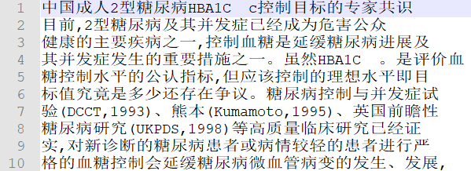
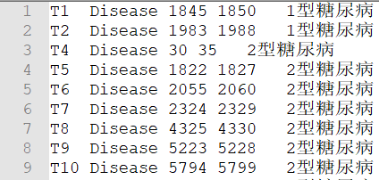
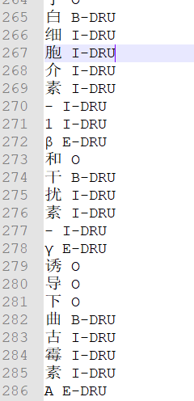
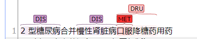
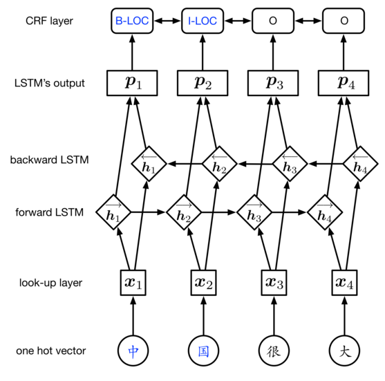
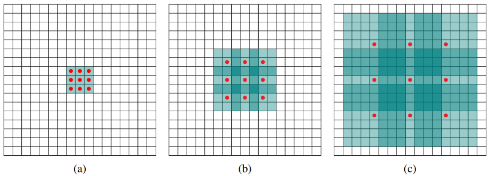
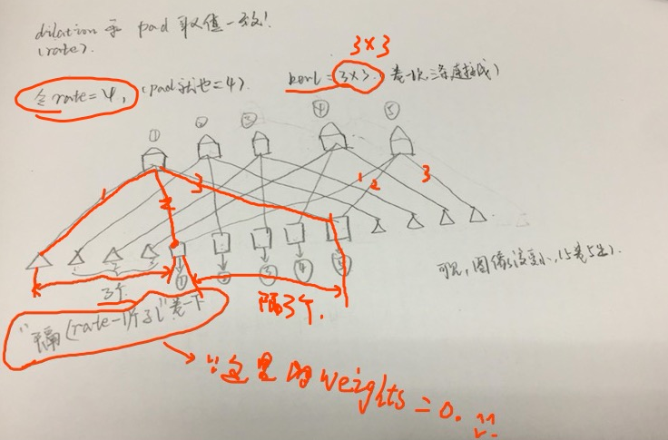
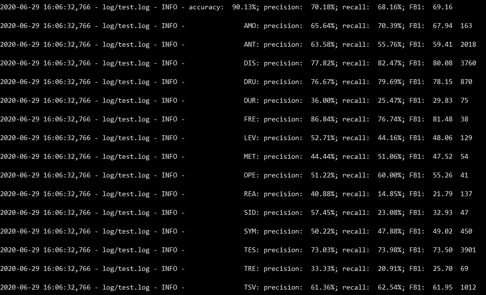

## CNER_v1项目总结

### 1. 项目背景

随着医院信息化的发展与普及，已逐步形成以电子病历系统（HIS）为核心。在电子病历系统数几年的使用过程中，积累了海量医疗文本数据，而这些文本数据包括与医学、健康密切相关的重要临床信息资源。

因此，对电子病历数据的信息提取显得尤为重要。但是，电子病历的文本数据并非完全结构化的形式，其中包含了**自由文本**及一些复杂**半结构化数据**，对信息的分析与利用造成了障碍。因此，需要通过命名实体识别（Named Entity Recognition，NER）技术从病历文本数据中的原始文本中提取有效的医疗、健康等相关概念实体。而对电子病历实体识别又简称为CNER（Clinical Named Entity Recognition）。

#### 1.2 项目数据

此项目数据来自于一个测评比赛中源自于上海瑞金医院对糖尿病文献的标注，其中原始文献数据如下：



对应的标注文件.ann如下：



以上就是产生的标注文件，其中T1为ID，Disease、Test、Test_Value等为实体类型，后面的一系列数字为句中标注数据的起止位置，而后面为标注的句中文本。首先根据实体类型个数可以得到实体字典总共15类实体类型如下表所示：

|  实体类型  | 实体简写 |      实体中文      |
| :--------: | :------: | :----------------: |
|   Level    |   LEV    |     等级-Level     |
| Test_Value |   TSV    | 检测值-Test_Value  |
|    Test    |   TES    |    测试类-Test     |
|  Anatomy   |   ANT    |   解剖类-Anatomy   |
|   Amount   |   AMO    |    程度-Amount     |
|  Disease   |   DIS    |   疾病类-Disease   |
|    Drug    |   DRU    |    药物类-Drug     |
| Treatment  |   TRE    | 治疗方法-Treatment |
|   Reason   |   REA    |    原因-Reason     |
|   Method   |   MET    |   方法类-Method    |
|  Duration  |   DUR    | 持续时间-Duration  |
| Operation  |   OPE    |  手术类-Operation  |
| Frequency  |   FRE    |   频率-Frequency   |
|  Symptom   |   SYM    |   症状类-Symptom   |
|  SideEff   |   SID    |   副作用-SideEff   |

总共15个类别，一共140028个实体，其中以0.2的比率进行分为训练集和测试集。

#### 1.3 项目结构

|-- project
        |-- conlleval.py
    |-- data_process.py
    |-- data_utils.py
    |-- directoryList.md
    |-- flaskserver.py
    |-- loader.py
    |-- main.py
    |-- model.py
    |-- train.log
    |-- utils.py
    |-- check
    |-- config
    |   |-- config_file
    |-- datas
    |-- dictdata
    |   |-- id_to_tag.txt
    |   |-- tag_to_id.txt
    |-- log
    |   |-- test.log
    |   |-- train.log
    |-- pickle
    |   |-- maps.pkl
    |-- result
    |   |-- ner_predict.utf8
    |   |-- result.json

以上为项目文件结构，其中conlleval.py为评估方法文件，data_process.py数据数据预处理文件，data_utils.py数据处理工具文件，flaskserver.py前端demo界面， loader.py加载数据文件，model.py模型文件，utils.py工具类文件，check文件夹存储模型文件，config存储配置文件，datas保存数据集文件，dictdata保存字典文件，log保存日志文件，result存储预测结果文件。

### 2. 项目思路简介

#### 2.1 数据预处理

数据采用iobes标注方式，则需要将.txt文件和.ann文件中的信息结构产生如下的数据格式：



目前在本项目中还无法处理嵌套实体，如果遇到嵌套实体目前只按照最大长度去标注，所以遇到如下情况：



只能将“口服降糖药”打上DRU标签。核心代码为下所示：

```python
# 开始迭代打标记
    for label in labels:
        # 首先取出对应的类别
        lab = entities_dict[label[0]]
        # 获取起始或结束的位置
        start = label[1]
        end = label[2]
        # 开始判断是否是单个字的标注
        if end - start == 1:
            check_single(start, lab)
            continue
        # 处理不是单个字的情况
        check(start, end - 1, lab)
        # 开始标注
        sentence[start][1] = 'B-' + lab
        sentence[end - 1][1] = 'E-' + lab
        # 标注中间字
        for i in range(start + 1, end - 1):
            sentence[i][1] = 'I-' + lab
    # 去掉停用词
    sentence = [w for w in sentence if w[0] not in stopwords]
```


#### 2.2 模型构建

本项目采用传统的BiLSTM-CRF作为基础网络架构，如下图所示：



**嵌入层：**

```python
embedding = []
        with tf.variable_scope("char_embedding" if not name else name):
            # 100维
            self.char_lookup = tf.get_variable(name="char_embedding", shape=[self.num_chars, self.char_dim],
                                               initializer=self.initializer)
            embedding.append(tf.nn.embedding_lookup(self.char_lookup, char_inputs))
            # 如果需要有分词嵌入
            if config["seg_dim"]:
                with tf.variable_scope("seg_embedding"):
                    self.seg_lookup = tf.get_variable(name="seg_embedding", shape=[self.num_segs, self.seg_dim],
                                                      initializer=self.initializer)
                    embedding.append(tf.nn.embedding_lookup(self.seg_lookup, seg_inputs))
            # 连接词向量与分词向量
            embed = tf.concat(embedding, axis=-1)
        return embed
```

其中在datas/emb_file/下面的vec.txt文件为预训练好的字级别的向量维度为100维，然后为了更好的进行识别额外的加入了分词特征，简单来说就是将每个标注序列的词的分词个数信息作为额外特征进行嵌入。一下为核心代码：

```python
def get_seg_features(string):
    """
    这里给我的感觉就是加入附加特征信息
    :param string:
    :return:
    """
    seg_feature = []
    # 遍历分词的结果列表
    for word in jieba.cut(string):
        # 如果分词为一个词
        if len(word) == 1:
            seg_feature.append(0)
        else:
            tmp = [2] * len(word)
            tmp[0] = 1
            tmp[-1] = 3
            seg_feature.extend(tmp)
    return seg_feature
```

后续可以考虑加入偏旁部首特征以及拼音特征作为额外特征输入到网络中去。

**BiLSTM层：**

此处构建一层双向的LSTM层作为上述特征向量的编码层，此处构建的代码可作为tf1.13以上的范式，代码如下：

```python
for direction in ["forward", "backward"]:
    with tf.variable_scope(direction):
        lstm_cell[direction] = tf.contrib.rnn.CoupledInputForgetGateLSTMCell(lstm_dim,
                                                                             use_peepholes=True,
                                                                             initializer=self.initializer,
                                                                             state_is_tuple=True)
        outputs, final_states = tf.nn.bidirectional_dynamic_rnn(lstm_cell["forward"],
                                                                lstm_cell["backward"],
                                                                model_inputs,
                                                                dtype=tf.float32,
                                                                sequence_length=lengths)
```

先分别定义LSTM_cell里面的前后向cell，此处采用CoupledInputForgetGateLSTMCell方法进行定义LSTMcell，然后使用bidirectional_dynamic_rnn进行封装整合前后向的编码信息。

**idCNN层：**

idCNN层名叫打孔CNN层是根据孔卷积的思想而来，首先要知道什么是孔卷积，直观的感受图为如下：



正如上图所示，可以看到当dilated为1对应的为图a）和普通的卷积操作没有任何区别，而当dilated为2时对应的图为b），其实对应的kernel size依然是3\*3，但是空洞为1，则实际的感受野扩大到了7\*7只是图中9个点有权重而其他的点权重都为0。图c）为孔4的卷积，感受野达到了15\*15，对比传统的conv操作，3层的3\*3卷积加起来只能达到$(kennel-1)*layer+1=7$的感受野，而dilatedconv感受野则是为指数增长，并且在不做pooling损失信息的情况下，增大了感受野。

对此以上的总结如下：

- 带孔卷积并不是并不是卷积核里面带孔，而是在卷积的时候，跳着的去卷积map(比如dilated＝2的孔卷积，就是隔一个像素点，“卷”一下，这就相当于把卷积核给放大了（3x3的核变成7x7的核，多出位置的weights给0就是)
- 带孔卷积并不增加参数数量，参数依然跟原卷积核一样，其他扩大的参数都为0（即是在增大感受野的同时，还不增加参数）。
- 设置好stride之后，慢慢一步步的滑过图像，之前设置为0的点会在某一次的卷积操作中被卷积到。



> 上图展示了参数为rate（孔数量）的卷积操作过程为：隔（rate-1）个孔卷一下

具体项目中实现细节，输入维度（[batch_size, num_steps, emb_size]）及为上一层嵌入层的输入，然后获取的输入需要先扩维度：

```python
model_inputs = tf.expand_dims(model_inputs, 1) # 因为需要进行2d卷积所以需要进行扩维
```

然后再构建图

```python
 	# 卷积参数
    filter_Weights = tf.get_variable("idcnn_filter",
                                     shape=[1, self.filter_width, self.embedding_dim, self.num_filter],
                                     initializer=self.initializer)
```

以上代码可以看出在对文本进卷积时卷积宽度一定是固定的1，卷积宽度为扫描上下文的个数相当于n-gram中的n，卷积深度就为词向量大小，第四个维度为卷积核的个数。

接下来由于摒弃了传统的pooling，故为了获取更高阶的特征，重复的分层卷积（具体的就是每层都进行不同孔的卷积操作），这样就能获取更高阶的特征。核心代码如下：

```python
# 分层级进行高阶卷积
for j in range(self.repeat_times):
    for i in range(len(self.layers)):
        # 获取打孔的参数
        dilation = self.layers[i]['dilation']
        # 判断是否是最后一层
        isLast = True if i == (len(self.layers) - 1) else False
        # 循环定义图
        with tf.variable_scope("atrous-conv-layer-%d" % i, reuse=True if (reuse or j > 0) else False):
            w = tf.get_variable("filterW", shape=[1, self.filter_width, self.num_filter, self.num_filter],
                                initializer=tf.contrib.layers.xavier_initializer())
            b = tf.get_variable("filterB", shape=[self.num_filter])
            # 开始打孔层
            conv = tf.nn.atrous_conv2d(layerInput, w, rate=dilation, padding="SAME")
            conv = tf.nn.bias_add(conv, b)
            # 激活层
            conv = tf.nn.relu(conv)
            # 判断是否是最后一层
            if isLast:
                finalOutFromLayers.append(conv)
                totalWidthForLastDim += self.num_filter
                layerInput = conv
```

对每层获取到的特征进行一个加和汇总，最终在第三个维度上进行拼接，如下：

```python
finalOut = tf.concat(axis=3, values=finalOutFromLayers)  # 4个100拼接为400
```

### 3. CRF层

为了解决Bi-LSTM层基于贪婪解码预测的标签无法满足实际标签顺序的需要（预测的结果为I-在前B-在后类似于这种顺序错误），故引入CRF层来解决解决预测标签顺序，针对CRF层需要知道两个得分矩阵：

- 标签矩阵（前面已经提到就是LSTM层输出的对应的每个词的标签分数）
- 转换分数（由转换矩阵得到）

|                | START | B-Person | I-Person | B-Organization | I-Organization | O    | END   |
| -------------- | ----- | -------- | -------- | -------------- | -------------- | ---- | ----- |
| START          | 0     | 0.8      | 0.007    | 0.7            | 0.0008         | 0.9  | 0.08  |
| B-Person       | 0     | 0.6      | 0.9      | 0.2            | 0.0006         | 0.6  | 0.009 |
| I-Person       | -1    | 0.5      | 0.53     | 0.55           | 0.0003         | 0.85 | 0.008 |
| B-Organization | 0.9   | 0.5      | 0.0003   | 0.25           | 0.8            | 0.77 | 0.006 |
| I-Organization | -0.9  | 0.45     | 0.007    | 0.7            | 0.65           | 0.76 | 0.2   |
| O              | 0     | 0.65     | 0.0007   | 0.7            | 0.0008         | 0.9  | 0.08  |
| END            | 0     | 0        | 0        | 0              | 0              | 0    | 0     |

类似于上表的转化矩阵，代表了对应标签的两两顺序得分，如下图所示：


有了以上两个得分矩阵，下面公式为CRF_LOSS：
$$
LossFunction=\frac{P_{realpath}}{P_1+P_2+P_3+...+P_N}
$$
以上就为CRF的Loss函数，其中PN为对应路径的概率值，下面主要是来看真实路径分数（Real path score）是如何定义的。所有路径的总分数为如下（ei代表第i条路径的分数）：
$$
P_{total}=P_1+P_2+...+P_N=e^{S1}+e^{S2}+...+e^{SN}
$$
随着训练的进行，真实路径的分数在所有路径中占的比重会越来越高。下面说明如何计算$S_i$：

- 除开句子的正常词数，额外的会添加2个词，代表START和END
- $S_i$= 发射分数（Emission score）+ 转化分数

其实发射分数就为标签分数这些分数在训练的过程中为LSTM的输出，而对应的额外添加的两个词就默认为0值。转化分数就为CRF层的参数，为对应转化矩阵中对应的分数，并且**在公式推导的过程中并不会对每一条路径都去迭代计算相应的分值**。

而在tensorflow中已经封装好了CRF的函数，在计算loss的时候调用

```python
log_likelihood, self.trans = crf_log_likelihood(inputs=logits,
                                                tag_indices=targets,
                                                transition_params=self.trans,
                                                sequence_lengths=lengths + 1)
```

以上代码返回loss，以及转移矩阵，而在对应测试解码阶段，采用viterbi_decode解码算法计算最大标签路径得到最终解码结果，代码如下：

```python
path, _ = viterbi_decode(logits, matrix)
# 不要start标志
paths.append(path[1:])
```

以上的具体代码都在model.py中，而conlleval.py里面为评估方法的封装，采用belu度量指标，分别输出模型对应的F1值以及对应标签的accuracy、recall、F1值等。

### 4. 项目结果

目前最好针对该测评任务的F1值大概为74左右，而此项目只能达到69左右（目前调的最高的值），结果如下图：



上图的测试结果保存在result文件夹下面，项目总结：

- Bilstm作为解码层的效果目前为最好，说明Bilstm还能够在一定文本长度下很好的抓取上下文特征
- idCNN训练速度很快，并且在多于Bilstm的迭代轮数得到的效果差不多

数据集地址：

链接：https://pan.baidu.com/s/13JH-N1VWmziLzqtAF8-FlQ 
提取码：iq3t

PS：flaskserver.py为一个网页展示demo